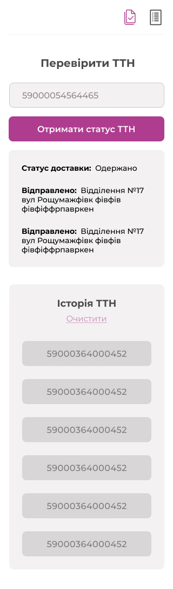
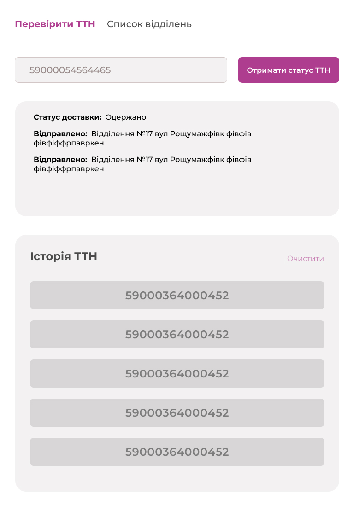
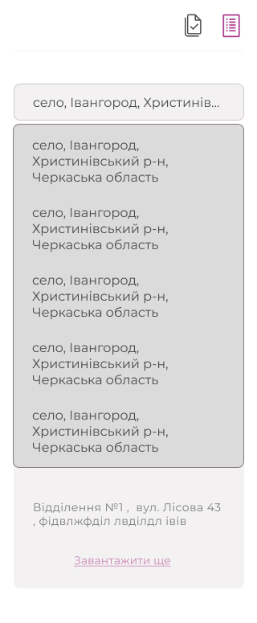
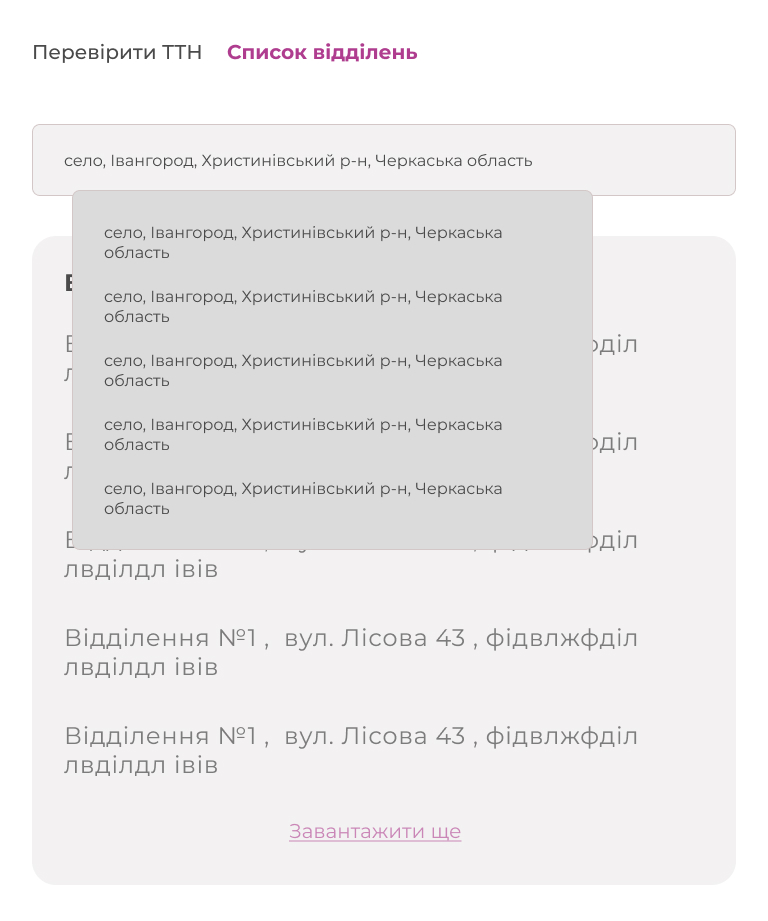

# New Post waybill app 

Here is a checking New Post waybills service. Here you can check waybills statuses by their number. Moreover, you can find any New Post warehouse by a settlement name.  

## Tech Stack

**Client:** Create React App, React, TypeScript, Redux Toolkit, RTK Query

**Libs:** react-router-dom, styled-components, axios, react-spinners, react-icons

## Authors

- [Anton Chertok](https://github.com/chertoha)

## Features

- customized design
- adaptive layout
- drop down select
- load more button

## Feedback

If you have any feedback, please reach out to us at a.chertok@akatech.com.ua

## Environment Variables

To run this project localy, you will need to add the following environment variables to your .env file

- `REACT_APP_NP_API_ENTRY_POINT` New Post API entry point,
- `REACT_APP_NP_API_KEY` - Developer API Key 

## Custom design Figma link
[Figma link design](https://www.figma.com/file/JHMgsXLp69oTT8uM2iq27o/Newpost-waybill-app?type=design&node-id=0%3A1&mode=design&t=bE8BMnvDtLnLvcNz-1)

## Custom design screenshots

### Mobile page "Waybill status"

### Tablet page "Waybill status"

### Mobile page "Waybill status"

### Mobile page "Find Warehouses"

### Tablet page "Find Warehouses"

### Mobile page "Find Warehouses"
